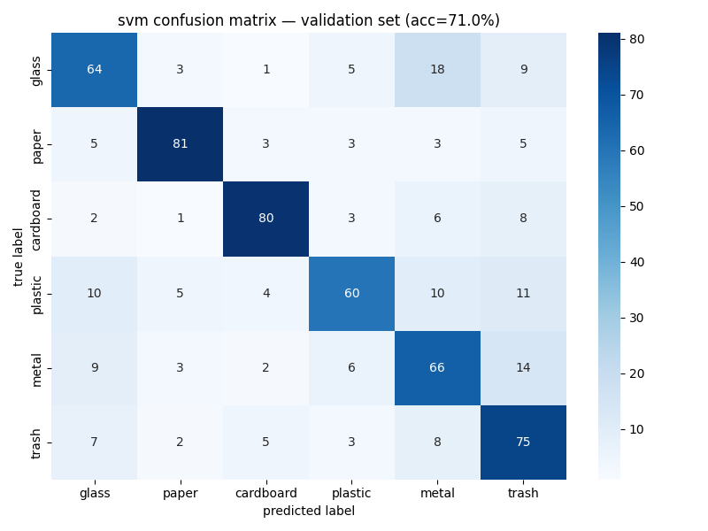
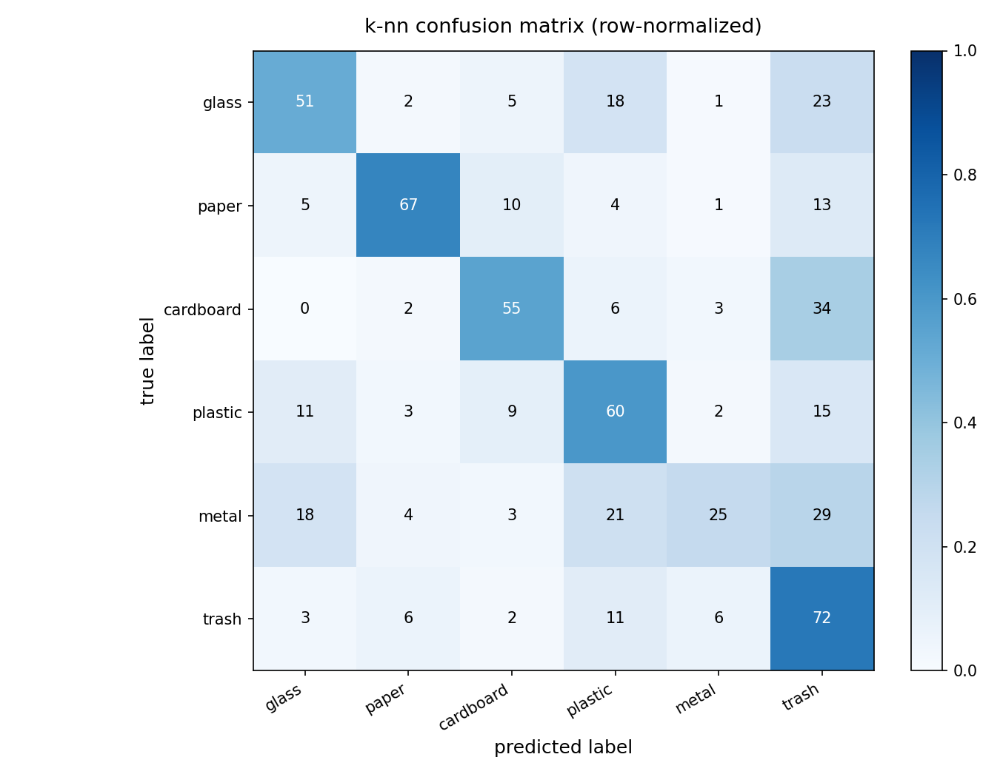
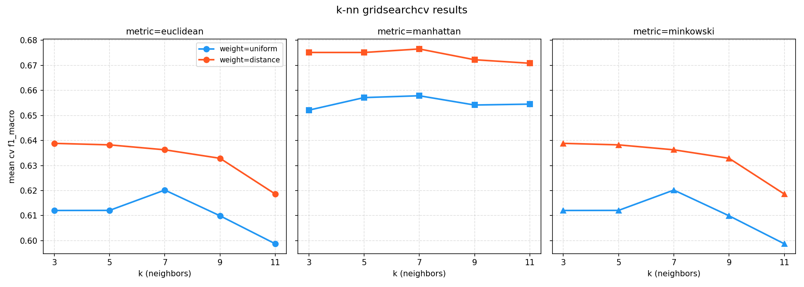

# MSI-System

<p align="left">
  
  
  
  
  
  
</p>

Automated waste material classification system using SVM and k-NN on handcrafted image feature vectors, with real-time camera deployment.

---

## Motivation

Waste sorting is a challenging vision problem where categories often share similar colors, textures, and shapes. Rather than relying on deep learning, this project uses handcrafted image descriptors and classical ML to build a compact, interpretable, and reproducible classifier — covering the full pipeline from raw images to live camera inference.

---

## Pipeline

```
Raw Images
    │
    ▼
Data Augmentation (balance classes to 500 each)
    │
    ▼
Feature Extraction (8 descriptors → 738-dim vector)
    │
    ▼
Feature Scaling (StandardScaler, fitted on train only)
    │
    ├──────────────► SVM Training
    │
    └──────────────► k-NN Training
                          │
                          ▼
                    Evaluation & Comparison
                          │
                          ▼
                  Real-Time Camera App
```

---

## Material Classes

| ID | Class | Description |
|----|-------|-------------|
| 0 | Glass | Bottles, jars |
| 1 | Paper | Newspapers, office paper |
| 2 | Cardboard | Boxes, packaging |
| 3 | Plastic | Water bottles, film |
| 4 | Metal | Aluminum cans, steel |
| 5 | Trash | Non-recyclable or contaminated waste |
| 6 | Unknown | Out-of-distribution or low-confidence inputs |

---

## Dataset

| Class | Original Count |
|-------|---------------|
| Cardboard | 259 |
| Glass | 401 |
| Metal | 328 |
| Paper | 476 |
| Plastic | 386 |
| Trash | 110 |
| **Total** | **1960** |

The dataset is included in `data/raw/` and augmented to 500 images per class (3000 total) before training.

---

## How It Works

### 1. Data Augmentation

Each class is augmented to exactly **500 images** using random transforms applied independently per image. The dataset grows from **1960 to 3000 images — a 53% increase**, then split 80/20 into training (2400) and validation (600) sets.

| Technique | Probability | Purpose |
|-----------|-------------|---------|
| Rotation (90°) | 50% | Handles arbitrary object orientation |
| Horizontal Flip | 50% | Simulates mirrored captures |
| Vertical Flip | 30% | Additional orientation variation |
| Color Jitter | 70% | Simulates varying lighting conditions |
| Gaussian Noise | 30% | Mimics sensor noise in cameras |
| Affine Transform | 60% | Simulates perspective and scale changes |

---

### 2. Feature Extraction

Each image is resized to **128×128 pixels** then converted into a **738-dimensional feature vector** by concatenating eight descriptors:

| Descriptor | What it captures | Details |
|------------|-----------------|---------|
| HOG | Shape and edge structure | 32×32 pixels per cell, 9 orientations |
| Color Histograms | Color distribution in BGR, HSV, and LAB | 32 bins × 9 channels |
| Color Moments | Mean, std, median per HSV channel | Compact color summary |
| LBP | Surface texture | Uniform, radius=3, 24 points |
| GLCM | Texture properties (contrast, dissimilarity, homogeneity, energy, correlation, ASM) | 3 distances × 4 angles |
| Hu Moments | Shape invariant to rotation, scale, translation | Log-transformed |
| Edge Features | Edge density and contour statistics via Canny | 4 values |
| Gabor Filters | Texture at 4 orientations | Mean and std per filter |

All features are standardized using **StandardScaler** fitted on training data only.

---

### 3. Classifiers

**SVM** — finds the maximum-margin decision boundary in feature space.

| Parameter | Value | Reason |
|-----------|-------|--------|
| Kernel | RBF | Handles non-linear class boundaries |
| C | 5 | Best from manual search over 1, 5, 10, 50, 100, 200, 500 |
| Gamma | scale | Auto-scales based on feature variance |
| Class weight | balanced | Compensates for class imbalance |

**k-NN** — classifies by weighted vote among nearest neighbors. Tuned using **GridSearchCV with 5-fold stratified cross-validation** across 30 combinations (k × weighting × metric).

| Parameter | Value | Reason |
|-----------|-------|--------|
| k | 7 | Best from search over 3, 5, 7, 9, 11 |
| Weighting | distance | Closer neighbors weigh more |
| Metric | Manhattan | Less sensitive to outlier dimensions than Euclidean |

---

### 4. Rejection Mechanism

Both models output a confidence score per class via `predict_proba()`. If the highest score is **below 0.5**, the input is classified as **Unknown**. This handles blurry frames, ambiguous objects, or materials outside the six trained classes. The threshold is adjustable via `CONFIDENCE_THRESHOLD` in `realtime_app.py`.

---

## Results

| Model | Best Configuration | Validation Accuracy |
|-------|-------------------|-------------------|
| SVM | C=5, RBF kernel, gamma=scale | 78.50% |
| k-NN | k=7, manhattan, distance weighting | 66.50% |

SVM was selected as the deployment model.

### SVM Confusion Matrix


### k-NN Confusion Matrix


### k-NN GridSearchCV Results


---

## Evaluation

### Per-Class F1 Comparison

| Class | SVM F1 | k-NN F1 |
|-------|--------|---------|
| Glass | 0.76 | 0.59 |
| Paper | 0.85 | 0.73 |
| Cardboard | 0.86 | 0.79 |
| Plastic | 0.81 | 0.67 |
| Metal | 0.73 | 0.60 |
| Trash | 0.72 | 0.62 |

Models were evaluated on a held-out validation set of **600 images** (100 per class) never seen during training.

---

## Key Findings

- SVM consistently outperforms k-NN across all six classes — largest gap in **plastic** (0.81 vs 0.67) and **metal** (0.73 vs 0.60)
- Switching HOG cell size from **16×16 to 32×32** was the single biggest accuracy improvement — coarser cells capture more global shape structure
- **Glass** remains the hardest class for both models due to reflective surfaces and low saturation overlapping with metal
- **Manhattan distance** outperforms Euclidean for k-NN on this feature space, being less sensitive to outlier dimensions

---

## Output Artifacts

After running the full pipeline, the following files are produced:

```
features/
├── X_train.npy        # training feature matrix
├── X_val.npy          # validation feature matrix
├── y_train.npy        # training labels
├── y_val.npy          # validation labels
└── scaler.pkl         # fitted standard scaler

models/
├── svm_model.pkl              # trained SVM
├── knn_model.pkl              # trained k-NN
├── svm_confusion_matrix.png
├── knn_confusion_matrix.png
├── knn_cv_results.png
└── knn_classification_report.txt
```

---

## Limitations

- Accuracy is bounded by handcrafted descriptor quality — deep feature extraction would likely improve performance on visually ambiguous classes like glass and metal
- The real-time app requires a working webcam and OpenCV GUI support
- Random seeds are fixed for reproducibility but results may vary slightly across platforms

---

## Real-Time Demo

> Screenshot coming soon.

The camera app captures live frames, extracts features, runs the SVM, and displays the predicted class with confidence. Press **Q** to quit.

---

## Repository Structure

```
MSI-System/
│
├── data/
│   ├── raw/                        # original unmodified dataset
│   └── augmented/                  # augmented and balanced dataset
│
├── features/                       # extracted feature vectors and scaler
├── models/                         # trained models and evaluation plots
│
├── src/
│   ├── augmentation.py             # data augmentation pipeline
│   ├── feature_extraction.py       # image to feature vector conversion
│   ├── train_svm.py                # SVM training and evaluation
│   ├── train_knn.py                # k-NN training and evaluation
│   └── realtime_app.py             # real-time camera classification app
│
├── report/
│   └── MSI_Report.docx             # technical report
│
├── requirements.txt
├── .gitignore
└── README.md
```

---

## Setup & How to Run

```bash
# install dependencies
pip install -r requirements.txt

# step 1 — augment and balance the dataset
python src/augmentation.py

# step 2 — extract feature vectors
python src/feature_extraction.py

# step 3 — train SVM
python src/train_svm.py

# step 4 — train k-NN
python src/train_knn.py

# step 5 — run real-time camera app
python src/realtime_app.py
```

---

## Contributors

<table>
  <tr>
    <td align="center">
      <b>Haneen Hisham</b><br/>
      <a href="https://github.com/haneens5905">@haneens5905</a>
    </td>
    <td align="center">
      <b>Shaza Moatasem</b><br/>
      <a href="https://github.com/shaza-22">@shaza-22</a>
    </td>
    <td align="center">
      <b>Ziad Tarek</b><br/>
      <a href="https://github.com/ziad-91">@ziad-91</a>
    </td>
    <td align="center">
      <b>Seif Waleed</b><br/>
      <a href="https://github.com/Malware404seif">@Malware404seif</a>
    </td>
    <td align="center">
      <b>Mohamed Ahmed</b><br/>
      <a href="https://github.com/mohamed-hamza20">@mohamed-hamza20</a>
    </td>
  </tr>
</table>
