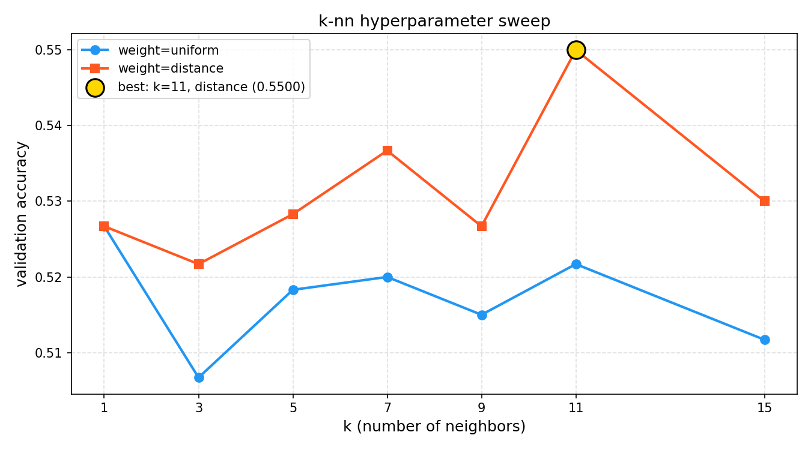

# MSI-System

<p align="left">
  
  
  
  
  
  
</p>

Automated waste material classification system using SVM and k-NN on image feature vectors, with real-time camera deployment.

---

## Project Overview

- Converts raw waste material images into fixed-length numerical feature vectors using **HOG**, **HSV Color Histogram**, and **LBP** descriptors
- Trains and compares two classifiers: **Support Vector Machine (SVM)** and **k-Nearest Neighbors (k-NN)**
- Implements a **confidence-based rejection mechanism** to handle unknown or ambiguous inputs
- Deploys the best-performing model in a **live real-time camera application**

---

## Dataset

The dataset contains images across six material classes organized into separate folders. Images vary in size, lighting, and orientation — reflecting real-world capture conditions.

| Class | Original Count |
|-------|---------------|
| Cardboard | 259 |
| Glass | 401 |
| Metal | 328 |
| Paper | 476 |
| Plastic | 386 |
| Trash | 110 |
| **Total** | **1960** |

The dataset is included in `data/raw/` and is augmented to 500 images per class (3000 total) before training.

---

## How It Works

### 1. Data Augmentation

Each class is augmented to exactly **500 images** using a combination of random transforms applied independently per image:

| Technique | Probability | Purpose |
|-----------|-------------|---------|
| Rotation (90°) | 50% | Handles arbitrary object orientation |
| Horizontal Flip | 50% | Simulates mirrored captures |
| Vertical Flip | 30% | Additional orientation variation |
| Color Jitter | 70% | Simulates varying lighting conditions |
| Gaussian Noise | 30% | Mimics sensor noise in cameras |
| Affine Transform | 60% | Simulates perspective and scale changes |

The dataset grows from **1960 to 3000 images — a 53% increase**. Images are then split 80/20 into training (2400) and validation (600) sets.

---

### 2. Feature Extraction

Each image is resized to **128×128 pixels** then converted into a **2302-dimensional feature vector** by concatenating three descriptors:

| Descriptor | What it captures | Dimensions |
|------------|-----------------|------------|
| HOG | Shape and edge structure | 1764 |
| HSV Color Histogram | Color distribution (lighting-robust) | 512 |
| LBP | Surface texture | 26 |
| **Total** | | **2302** |

All feature vectors are standardized using **StandardScaler** (fitted on training data only) before being passed to the classifiers.

---

### 3. Classifiers

**SVM** — finds the maximum-margin decision boundary in the 2302-dimensional feature space.

| Parameter | Value | Reason |
|-----------|-------|--------|
| Kernel | RBF | Handles non-linear class boundaries |
| C | 5 (best from search over 1–500) | Optimal regularization |
| Gamma | scale | Auto-scales based on feature variance |
| Class weight | balanced | Handles remaining class imbalance |

**k-NN** — classifies by majority vote among the k nearest neighbors in feature space.

| Parameter | Value | Reason |
|-----------|-------|--------|
| k | 11 (best from search over 1–15) | Optimal neighborhood size |
| Weighting | distance | Closer neighbors weigh more |
| Metric | Euclidean | Standard for normalized features |

---

### 4. Rejection Mechanism (Unknown Class)

Both classifiers support `predict_proba()`, which outputs a confidence score per class. If the highest confidence score is **below 0.5**, the input is classified as **Unknown** instead of forcing a prediction. This handles blurred frames, mixed materials, or objects outside the six trained classes.

The threshold is configurable via `CONFIDENCE_THRESHOLD` in `realtime_app.py`.

---

## Results

| Model | Best Configuration | Validation Accuracy |
|-------|-------------------|-------------------|
| SVM | C=5, RBF kernel | 71.00% |
| k-NN | k=11, distance weighting | 55.00% |

SVM was selected as the deployment model. k-NN underperforms significantly on the 2302-dimensional feature space due to the **curse of dimensionality** — distances between high-dimensional points become increasingly uniform, making nearest-neighbor search unreliable.

### SVM Confusion Matrix


### k-NN Confusion Matrix


### k-NN Hyperparameter Sweep


---

## Evaluation

Models were evaluated on a held-out validation set of **600 images** (100 per class) that were never seen during training. The following metrics were computed:

- **Overall accuracy** — percentage of correctly classified images
- **Per-class precision** — of all predictions for a class, how many were correct
- **Per-class recall** — of all true instances of a class, how many were correctly identified
- **F1-score** — harmonic mean of precision and recall per class
- **Confusion matrix** — full breakdown of predictions vs true labels

### Per-Class F1 Comparison

| Class | SVM F1 | k-NN F1 |
|-------|--------|---------|
| Glass | 0.65 | 0.54 |
| Paper | 0.83 | 0.73 |
| Cardboard | 0.82 | 0.60 |
| Plastic | 0.67 | 0.55 |
| Metal | 0.63 | 0.36 |
| Trash | 0.68 | 0.50 |

---

## Key Findings

- SVM consistently outperforms k-NN across all six classes — the gap is largest for **metal** (0.63 vs 0.36) and **cardboard** (0.82 vs 0.60)
- **Paper and cardboard** are the easiest classes to classify, likely due to their distinctive flat texture and neutral color profile
- **Glass and metal** are the hardest — both have low saturation, reflective surfaces, and overlapping color distributions
- **Distance weighting** in k-NN consistently outperforms uniform weighting across all k values
- k-NN training accuracy is **1.0 for all distance-weighted configurations**, indicating severe overfitting
- The 71% SVM accuracy reflects the inherent limitations of handcrafted descriptors on visually similar material classes — deep feature extraction would likely improve this significantly

---

## Sample Output

Running `train_svm.py`:
```
loading feature vectors...
  X_train: (2400, 2302) | X_val: (600, 2302)
searching over c values (rbf kernel, gamma=scale)...

  c=1     → val accuracy = 69.67%
  c=5     → val accuracy = 71.00%
  c=10    → val accuracy = 70.83%
  ...

  best c: 5
  best val accuracy: 71.00%

per-class report:
              precision    recall  f1-score   support
       glass       0.66      0.64      0.65       100
       paper       0.85      0.81      0.83       100
   cardboard       0.84      0.80      0.82       100
     plastic       0.75      0.60      0.67       100
       metal       0.59      0.66      0.63       100
       trash       0.61      0.75      0.68       100
    accuracy                           0.71       600
```

---

## Real-Time Demo

> Screenshot coming soon.

The live camera application captures frames, extracts features, and displays the predicted material class with confidence percentage in real time. Press **Q** to quit.

---

## Repository Structure

```
MSI-System/
│
├── data/
│   ├── raw/                        # original unmodified dataset
│   └── augmented/                  # augmented and balanced dataset (~500 per class)
│
├── features/
│   ├── X_train.npy                 # training feature vectors
│   ├── X_val.npy                   # validation feature vectors
│   ├── y_train.npy                 # training labels
│   ├── y_val.npy                   # validation labels
│   └── scaler.pkl                  # fitted standard scaler
│
├── models/
│   ├── knn_model.pkl               # trained k-NN model
│   ├── svm_model.pkl               # trained SVM model (see download link below)
│   ├── svm_confusion_matrix.png    # SVM confusion matrix
│   ├── knn_confusion_matrix.png    # k-NN confusion matrix
│   ├── knn_experiment_results.png  # k-NN accuracy vs k plot
│   └── knn_classification_report.txt
│
├── src/
│   ├── augmentation.py             # data augmentation pipeline
│   ├── feature_extraction.py       # image to feature vector conversion
│   ├── train_svm.py                # SVM training and evaluation
│   ├── train_knn.py                # k-NN training and evaluation
│   └── realtime_app.py             # real-time camera classification app
│
├── report/
│   └── MSI_Report.docx             # technical report
│
├── requirements.txt
├── .gitignore
└── README.md
```

---

## Getting Started

### 1. Install Dependencies
```bash
pip install -r requirements.txt
```

### 2. Download the SVM Model
The trained SVM model is too large for GitHub. Download it and place it in `models/`:

[Download svm_model.pkl from Google Drive](https://drive.google.com/file/d/12YobzdaWK0lZNoNTBtPQbYGBBOTKWwcu/view?usp=sharing)

---

## How to Run

```bash
# step 1 — augment and balance the dataset
python src/augmentation.py

# step 2 — extract feature vectors from all images
python src/feature_extraction.py

# step 3 — train and evaluate SVM
python src/train_svm.py

# step 4 — train and evaluate k-NN
python src/train_knn.py

# step 5 — run the real-time camera app
python src/realtime_app.py
```

---

## Technologies Used

| Technology | Purpose |
|------------|---------|
| Python | Core programming language |
| OpenCV | Image processing and real-time camera feed |
| scikit-learn | SVM and k-NN implementation |
| scikit-image | HOG and LBP feature extraction |
| NumPy | Feature vector storage and manipulation |
| joblib | Model serialization |
| Pillow | Image loading and augmentation |
| seaborn | Confusion matrix visualization |
| tqdm | Progress bars during training and extraction |
